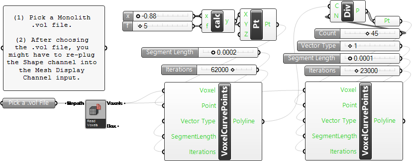
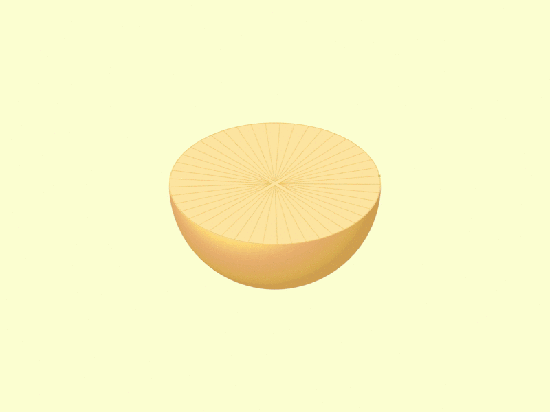
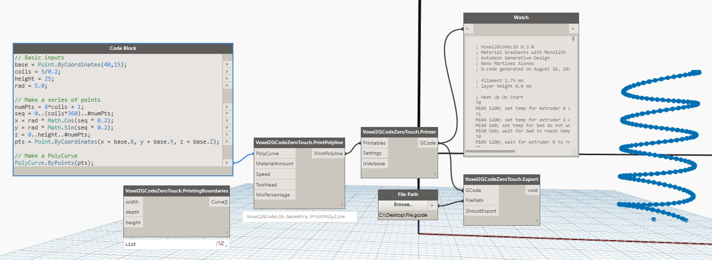

# Voxel2GCode

*A set of workflows to transform geometric objects and voxel-based models into 3D-printable G-code instructions.*


`Voxel2GCode` is a project on early stages which aims for a flexible, customizable workflow for 3D printing, which started as part of the **Material Gradients with Monolith** project by [Nono Martínez Alonso](http://nono.ma) while working with the Autodesk Generative Design Group, during the summer of 2016. As an effort to simplify how instructions are sent to 3D printers, the project is structured to make the implementation of custom printing and slicing workflows easy, and to fabricate artifacts from geometric objects and voxel-based models with low cost multi-material 3D printers.

[Tweet this](https://twitter.com/intent/tweet?text=Voxel2GCode by @nonoesp,%20transform%20geometric%20objects%20and%20voxel-based%20models%20into%203D-printable%20G-code%20instructions%20with%20%23gh3d%20and%20@DynamoBIM.).

In a nutshell, Voxel2GCode provides five tools:
* Voxel2GCodeCore as a standalone .NET library.
* Voxel2GCodeRhinoCommon for scripting with C# using RhinoCommon.
* Voxel2GCodeGH as a Grasshopper for Rhino plugin.
* Voxel2GCodeDesignScript for scripting with C# using DesignScript.
* Voxel2GCodeDynamo as a Dynamo package.

## Table of Contents

* [Installation](#installation)
* [Reference](#reference)
* [Usage](#usage)

## Installation

### Voxel2GCodeCore
* Download and install [Monolith](http://monolith.zone/download). (Voxel2GCode requires Monolith installed in your computer.)

### Voxel2GCode for Grasshopper and RhinoCommon

* Download the Voxel2GCodeGH.gha
* Copy it to your Grasshopper components folder.
* You’ll need to copy Monolith dependencies to the components folder.

### Voxel2GCode for Dynamo and DesignScript

* Open a new Dynamo document.
* Under the nodes tab, click on `Import`, and select the `Voxel2GCode for Dynamo.dll` library.

## Reference

### Voxel2GCodeCore

A .NET library to write G-code instructions from geometric objects.

* V2GModel
* V2GPath
* V2GSettings
* V2GSlice
* V2GState

#### Primitives

* V2GPoint
* V2GLine
* V2GCurve
* V2GVoxelPoint

#### Printables

Geometric objects augmented with printing metadata.

* V2GPrintable
* V2GPrintPosition
* V2GPrintPolyline

#### Instructions

* V2GInstruction
* V2GMovement
* V2GPrintSegment

#### Utilities

* V2GGeometry
* V2GMath
* V2GPrint
* V2GVoxel

### Voxel2GCodeRhinoCommon

A .NET library for RhinoCommon-specific functions of Voxel2GCode. It subclasses and expands classes of the Core library to use specific RhinoCommon functions.

* V2GRhinoCurve
* V2GRhinoGeometry

### Voxel2GCodeGH

A Grasshopper for Rhino plugin.

* *Construct PrintPoint (WIP)*
* Construct PrintPolyline
* Construct Printer
* Extract PrintPolylineData
* *PrintSettings (TODO)*
* *PrintingBoundaries (TODO)*
* Export G-code  
&nbsp;
* SortCurves
* Get BoundingFrames
&nbsp;
* Construct VoxelPoint
* Get VoxelCurvePoints

Implementation of Voxel2GCodeLib for Grasshopper.

### Voxel2GCodeDesignScript

A .NET library for DesignScript-specific functions of Voxel2GCode.

* V2GDesignScriptCurve
* V2GDesignScriptGeometry

### Voxel2GCodeDynamo

A ZeroTouch Dynamo package.

* PrintPoint
* PrintPolyline
* PrintPolylineData
* Printer
* PrintSettings
* Export  
&nbsp;
* CurveSort
* CurveSinusoidalPoints

## Basic Usage

Here are a few examples on how to use the library for scripting, with Grasshopper for Rhino, and with Dynamo. More in detail examples are being developed.

### Voxel2GCodeCore

#### Printing A Polyline

```csharp
// Create a printer
V2GState printer = new V2GState();

// Create a printable model
V2GModel model = new V2GModel();

// Create a list of points to hold positions
List<V2GPoint> positions = new List<V2GPoint>();

// Add positions
positions.Add(new V2GPoint(25.0, 40.0, 0.0));
positions.Add(new V2GPoint(30.0, 45.0, 0.0));
positions.Add(new V2GPoint(35.0, 40.0, 0.0));

// Create a printable polyline
V2GPrintPolyline printPolyline = new V2GPrintPolyline();
foreach(V2GPoint position in positions) {
  Print(position.ToString() + " " + position.X);
  printPolyline.AddPrintPosition(position);
}

// Append the printable polylines as paths to the model
model.AppendAsPath(printPolyline);

// Create a StringBuilder to store G-code
System.Text.StringBuilder sb = new System.Text.StringBuilder();
model.GenerateGCode(sb, printer);

// Create a string with G-code
string GCode = sb.ToString();
```

#### Create a Printer with Custom Settings

```csharp
// Create a printer
V2GState printer = new V2GState();

// Create printing settings
V2GSettings settings = new V2GSettings();

// Override some parameters
settings.T0Temperature = 220.0;
settings.BedTemperature = 80.0;
settings.ZOffset = 0.5;
settings.Retraction_Length = 0.3;

// Attach the settings to the printer
printer.SetSettings(settings);
```

### Voxel2GCodeGH

#### Printing A Polyline With Custom Settings


#### Extract Gradient and Contour Curves From A Monolith Vol File





### Voxel2GCodeDynamo

#### Printing A PolyCurve



## Sample Files

Grasshopper and Dynamo sample files will be posted soon.

## Acknowledgements

The development of Voxel2GCode was sponsored by [Autodesk Inc](http://www.autodesk.com/), as part of a summer research residency project in Boston, 2016. Please take a look at the [detailed list of acknowledgments](docs/Acknowledgments.md).

Voxel2GCode was created and is maintained by [Nono Martínez Alonso](http://nono.ma).

## License

Voxel2GCode is licensed under the [MIT license](LICENSE).

## Me

I'm [Nono Martínez Alonso](http://nono.ma) (nono.ma), a computational designer and architect with a penchant for simplicity.  
I tweet at [@nonoesp](http://www.twitter.com/nonoesp) and write at [Getting Simple](http://gettingsimple.com/). If you use Voxel2GCode, I would love to hear about it. Thanks!

## Contributing

In its early stages, Voxel2GCode sets a base structure for growth and flexibility. Any kind of contribution or collaboration is welcome. If you are interested in playing around with this library [shot me a tweet](https://twitter.com/intent/tweet?text=Hi%20@nonoesp,%20I%27ve%20seen%20Voxel2GCode%20and%20your-message-here.).